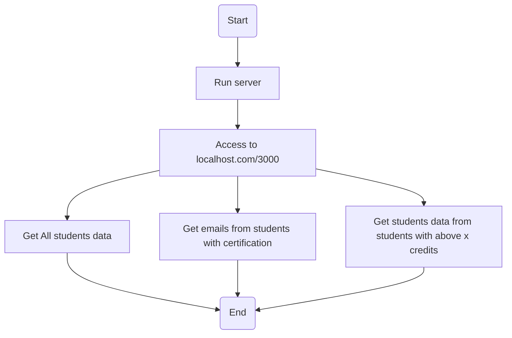
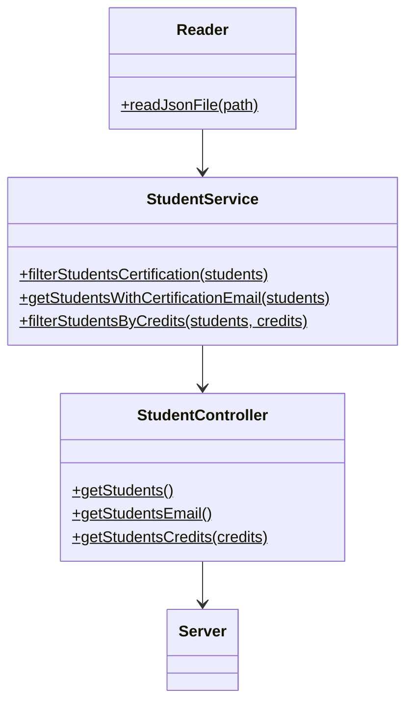

# w4 - Code Challenge
Author: @felixVelazco

API que permita acceder a diversos datos de un archivo `JSON`, el cual tiene una lista de objetos con varios estudiantes.
El proposito general de la API es:

1. Habilitar un endpoint para consultar todos los estudiantes con todos sus campos.
2. Habilitar un endpoint para consultar los emails de todos los estudiantes que tengan certificación haveCertification.
3. Habilitar un endpoint para consultar todos los estudiantes que tengan credits mayor a 500.

## Requisitos
- Instalar `node` y `npm` [Link a la página de Node](https://nodejs.org/es/download/)

## Instalación 
- En la carpeta donde quieras tener este repositorio, abre tu terminal y corre 
``` console
git clone https://github.com/felixVelazco/w4-code-challenge.git
```
- Ve a la carpeta raiz del proyecto e instala las dependencias de `Node.js` con
``` console
npm install
```

## Diagramas de flujo

## Diagrama de clases

## Procedimiento

EN CONSTRUCCIóN
